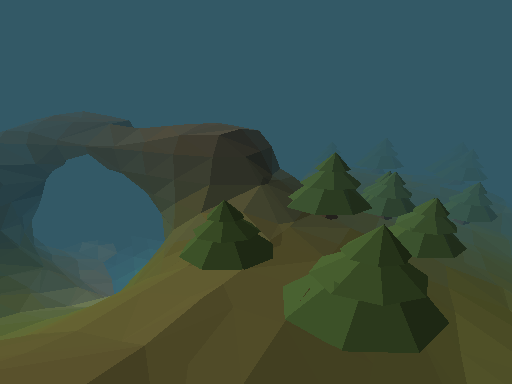
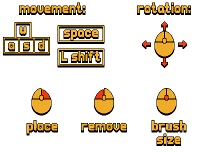

Löve3D is a proof of concept exploring the third dimension and the marching cubes algorithm!

 

The 3D rendering is built without any matrix libraries, meaning that I have had to learn a lot of linear algebra to create this project. The basics of projecting a 3D shape onto a 2D screen lies within the magic of matrix multiplication. The "dot" and "cross" products are something that i will be taking with me to future projects as well. 

 

## Features:

* An infinite world

* An interactive implementation of the marching cubes algorithm

* Terrain generation with caves and overhangs

* Terrain editing

* Very simple triangle-sphere collision detection

* An .obj file loader

* Trees

## Controls:

 

This project is far from finished and could be greatly expanded upon, if not for the fact that performance is horrible. It turns out that the löve2D engine, with 2D in it's name, is not very well suited to project and draw tens of thousands of triangles every frame. There are several features which i have had to cut simply because they are too expensive. I do feel like I have grown as coder by working around these performance constraints, in a foreign language, with a foreign engine, in a foreign dimension. 
